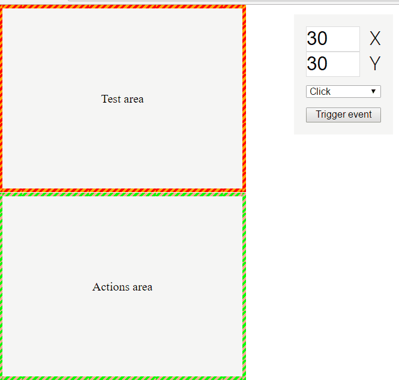

DOM events mocking
[](https://badge.fury.io/js/dom-events-mocking) [](https://circleci.com/gh/rumax/dom-events-mocking)

=============

Wraps the DOM API to make real event mocking in-browser using method chaining.

```js
npm install --save dome-events
```


Implements the following DOM events methods and helpers:
  - `click`
  - `dblclick`
  - `drag`
  - `at`
  - `wait`
  - `exec`
  - `async`
  - `done`
  - etc.


## Why Do I Need This?

If you want to test you application and want/can use JavaScaript only, but still cover UI events. Or write som eintegration tests:

```
it('Can handle my events', (done) => {
  const btn = document.getElelemntById('YOUR_BUTTON');

  events
    .click(btn)
    .exec(() => {
      expect('YOUR_VALIDATION').toBeTruthy();
    })
    .click(() => {
      // Dynamically created button
      return document.getElelemntById('YOUR_NEW_BUTTON');
    })
    .exec(() => {
      expect('YOUR_ANOTHER_VALIDATION').toBeFalsy();
    })
    .done(() => {
      console.log('All steps executed');
      done();
    });
});
```



Based on [happen](https://www.npmjs.com/package/happen).

## License

MIT
